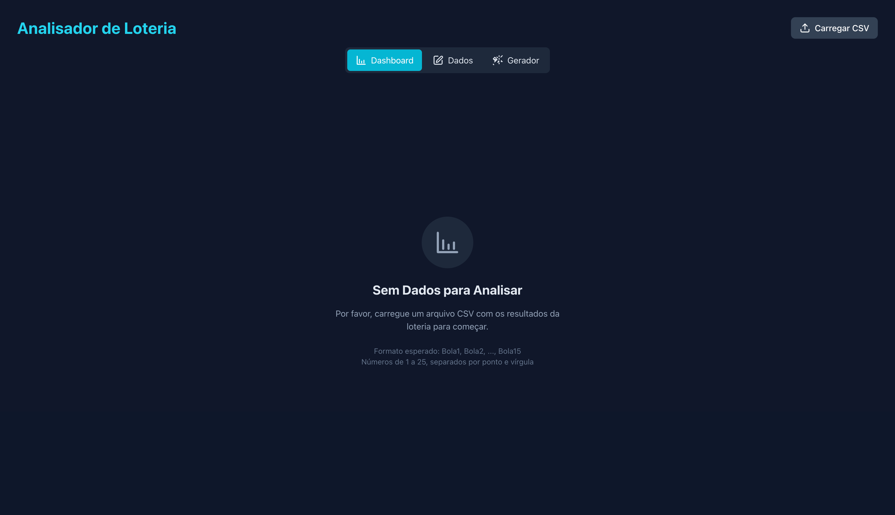
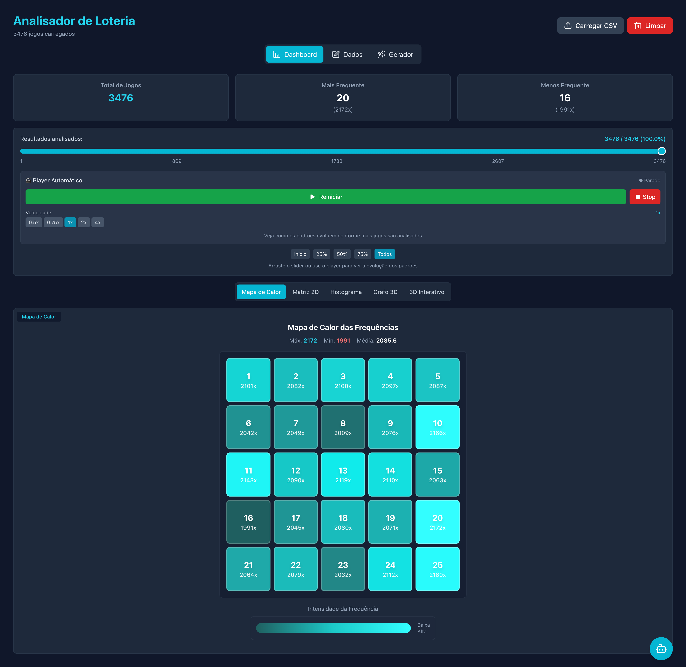

# ✅ README Atualizado com Galeria Visual Completa

## 🎯 **Melhorias Implementadas no README**

### **📸 Galeria de Funcionalidades Adicionada**
Criei uma seção visual completa que mostra todas as funcionalidades do sistema usando as 5 imagens fornecidas:

#### **🖼️ Imagens Utilizadas:**
1. **`01.png`** - Dashboard principal com estatísticas e controles
2. **`02.png`** - Visualizações 2D (Mapa de Calor + Matriz 2D)
3. **`03.png`** - Visualizações 3D (Grafo tridimensional)
4. **`04.png`** - Player automático com controles avançados
5. **`05.png`** - Gerador de jogos + Assistente IA

### **📋 Seções Criadas e Melhoradas**

#### **1. Cabeçalho Visual**
```markdown

*Dashboard principal com múltiplas visualizações e player automático*
```
- **Impacto imediato** ao abrir o README
- **Mostra a interface** real do sistema
- **Desperta interesse** do usuário

#### **2. Galeria de Funcionalidades**
```markdown
## 📊 **Galeria de Funcionalidades**

### 🎯 **Interface Principal**
O dashboard oferece uma visão completa dos dados...


### 📏 **Visualizações 2D Avançadas**  
Mapa de calor inteligente e matriz 2D...

```
- **5 seções detalhadas** com imagens
- **Descrições contextuais** para cada imagem
- **Explicação técnica** das funcionalidades mostradas

#### **3. Fluxo de Uso do Sistema**
```markdown
## 🎯 **Fluxo de Uso do Sistema**

### **📊 1. Dashboard e Análise**
Após carregar os dados, o dashboard principal oferece...

```
- **Guia passo-a-passo** com imagens
- **Explicação detalhada** de cada funcionalidade
- **Contexto prático** de uso de cada ferramenta

### **🎨 Características Visuais Implementadas**

#### **📐 Layout Profissional:**
- **Imagens centralizadas** com `<div align="center">`
- **Legendas descritivas** em itálico
- **Seções bem estruturadas** com headers hierárquicos
- **Emojis consistentes** para navegação visual

#### **📝 Conteúdo Didático:**
- **Explicações detalhadas** de cada imagem
- **Contexto técnico** das funcionalidades
- **Benefícios práticos** de cada ferramenta
- **Fluxo lógico** de utilização

#### **🔗 Organização Clara:**
```markdown
**Mapa de Calor (Esquerda):**
- **Grid 5x5**: Todos os 25 números organizados
- **Cores intensas**: Vermelho = mais frequente
- **Tooltips**: Informações detalhadas
- **Legenda**: Escala de cores
```

### **📊 Impacto das Melhorias**

#### **✅ Para o Usuário:**
- **Compreensão visual** imediata do que o sistema faz
- **Fluxo claro** de como usar cada funcionalidade
- **Expectativas corretas** sobre as capacidades
- **Motivação aumentada** para testar o sistema

#### **✅ Para o Projeto:**
- **Apresentação profissional** e atrativa
- **Documentação completa** com evidências visuais
- **Facilita adoção** por novos usuários
- **Demonstra qualidade** e maturidade do sistema

### **🎯 Seções do README Agora Incluem**

#### **📋 Estrutura Completa:**
1. **Cabeçalho com imagem** - Impacto visual inicial
2. **Galeria de funcionalidades** - Overview visual completo
3. **Sobre o projeto** - Descrição técnica
4. **Principais funcionalidades** - Lista organizada
5. **Como executar** - Instruções detalhadas
6. **Preparação dos dados** - Guia da Lotofácil
7. **Fluxo de uso** - Tutorial visual passo-a-passo ⭐ **NOVO**
8. **Arquitetura** - Detalhes técnicos
9. **Demais seções** - Deploy, contribuição, etc.

#### **🎨 Visual Highlights:**
- **Dashboard principal** destacado no início
- **Comparações lado-a-lado** (2D vs 3D)
- **Player automático** com controles visíveis
- **Integração IA** demonstrada visualmente
- **Gerador inteligente** com interface real

### **📈 Resultado Final**

#### **🎯 Antes vs Depois:**

**❌ Antes:**
- README apenas textual
- Funcionalidades descritas sem contexto visual
- Usuário precisava imaginar como seria o sistema
- Dificuldade em entender o valor das funcionalidades

**✅ Depois:**
- **Galeria visual completa** mostrando todas as funcionalidades
- **Fluxo de uso ilustrado** passo-a-passo
- **Interface real** visível antes mesmo de instalar
- **Compreensão imediata** do valor e capacidades do sistema

#### **🚀 Benefícios Alcançados:**
- **Primeira impressão profissional** com dashboard real
- **Confiança do usuário** ao ver o sistema funcionando
- **Redução de dúvidas** sobre funcionalidades
- **Motivação para testar** todas as funcionalidades
- **Documentação visual** que facilita suporte e onboarding

---

## 🎉 **README Completamente Atualizado!**

**O README agora oferece uma experiência visual completa que:**

✅ **Mostra** todas as funcionalidades implementadas  
✅ **Explica** como usar cada ferramenta  
✅ **Guia** o usuário através do fluxo completo  
✅ **Demonstra** a qualidade e profissionalismo do projeto  
✅ **Motiva** novos usuários a experimentar o sistema  

**Resultado: Um README que vende o projeto visualmente e tecnicamente!** 🎯📊✨
